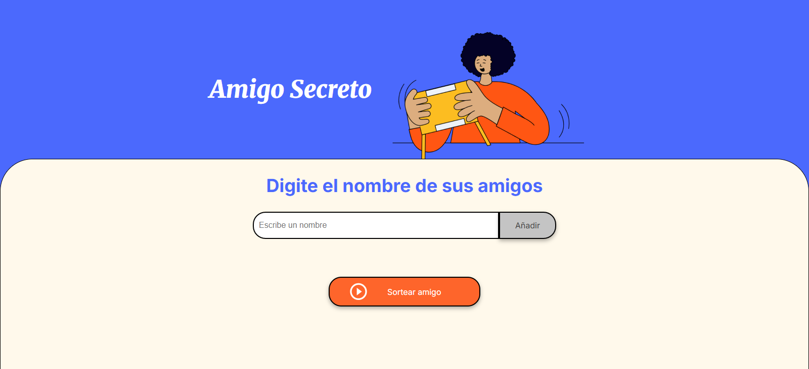

---

# 🎁 Amigo Secreto

Una aplicación web sencilla desarrollada con **HTML, CSS y JavaScript** que permite a los usuarios ingresar nombres de participantes y sortear aleatoriamente un "amigo secreto". Ideal como ejercicio introductorio de lógica de programación.

---

## 🚀 Funcionalidades

- ✅ Permite ingresar nombres válidos de participantes.
- ⛔ Evita agregar entradas vacías.
- 🔁 Presionar `Enter` también agrega nombres.
- 🎲 Al presionar "Sortear amigo", se elige un nombre aleatorio de la lista.
- 🧹 Limpia la lista visual y reinicia los datos después de cada sorteo.

---

## 🧠 Tecnologías usadas

- HTML5
- CSS3
- JavaScript (puro / vanilla JS)

---

## 📸 Vista previa



---

## 🗂️ Estructura del proyecto

```

📁 amigo-secreto/
├── index.html
├── style.css
├── app.js
└── assets/
├── amigo-secreto.png
├── amigo-secreto-preview.png
└── play\_circle\_outline.png

````

---

## 🔧 Cómo usarlo

1. Clona este repositorio o descarga los archivos:
   ```bash
   git clone https://github.com/tu-usuario/amigo-secreto.git
````

2. Abre `index.html` en tu navegador.

3. Empieza a escribir nombres, añádelos con el botón o la tecla Enter.

4. Da clic en **"Sortear amigo"** para seleccionar al azar.

---

## 📚 Objetivo del proyecto

Este proyecto forma parte de un curso de introducción a la programación, con el objetivo de practicar:

* Declaración de variables
* Condicionales (`if` / `else`)
* Funciones
* Arreglos (arrays)
* Manipulación del DOM
* Eventos del teclado y botones

---

## 🙌 Autor

Desarrollado por [José Luis Cordero](https://github.com/alter-ipse-coder).
[Linkedin](https://www.linkedin.com/in/jose-luis-cordero-/) 
Este proyecto es de uso libre para fines educativos.

---


